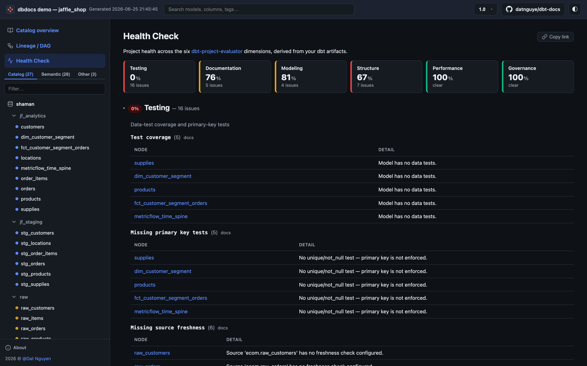

<p align="center">
  
</p>

<p align="center"><b>An alternative dbt docs site — catalog + ERD + column-level lineage + versioned deploys, all in one CLI.</b></p>

<p align="center">
  <a href="https://dbdocs.datnguye.me/latest/demo/latest/"></a>
  <a href="https://dbdocs.datnguye.me/"></a>
  <a href="https://pypi.org/project/dbdocs/"></a>
  
  <a href="https://opensource.org/licenses/MIT"></a>
  <a href="https://www.python.org"></a>
</p>

Turn your dbt artifacts into a self-contained docs site: a browsable catalog, an entity-relationship diagram, an interactive lineage DAG, and **column-level lineage** traced from your compiled SQL — all in one `dbdocs generate`. Serve it with `dbdocs serve`, or deploy versioned builds anywhere a static host will take them.

| Catalog | Model page | Lineage DAG | Health Check |
|---|---|---|---|
|  |  |  |  |

## Why dbdocs?

dbt's built-in docs stop short of telling you *which upstream column fed this downstream column*, *which tables relate to each other*, or *what changed between builds*. dbdocs fills those gaps — no documentation framework or separate ERD tool to install.

- **ERD + column-level lineage** — table relationships ([dbterd](https://github.com/datnguye/dbterd)) and column lineage from compiled SQL ([sqlglot](https://github.com/tobymao/sqlglot)).
- **Column impact analysis** — downstream dependents for any column.
- **Deep-link URLs** for every node, column, and DAG view.
- **Any sqlglot dialect**, auto-detected from your manifest.
- **Scales to 1 000s of models** without freezing the browser.
- **Fail-soft** — an unparseable model is skipped, not fatal.
- **Project Health Check** across the six [dbt-project-evaluator](https://dbt-labs.github.io/dbt-project-evaluator/) dimensions.
- **Versioned deploys** with a built-in version switcher, no plugins.
- **Full-text search** across names, columns, descriptions, tags, and SQL at the client-side, no backend.
- **Static REST API** (`api/v1/`) — addressable JSON for every node, lineage, and health, for headless / agent consumption.
- **Dark / light theme.**

## Install

```bash
pip install dbdocs --upgrade
```

Requires Python 3.10+.

## Quickstart

```bash
dbt docs generate     # writes target/manifest.json + target/catalog.json
dbdocs generate       # builds ./site/ with index.html + dbdocs-data.json.gz
dbdocs serve          # static http server on http://127.0.0.1:8000
```

The site must be served over HTTP (not opened as a local file) because it fetches the data payload at load time. `dbdocs serve` handles that locally; any static host works for deployment.

Full walkthrough, configuration, and architecture live in the **[documentation](https://dbdocs.datnguye.me/)**.

## Contributing

Contributions are welcome — bugs, features, docs, typos. See the **[Contributing Guide](https://dbdocs.datnguye.me/latest/nav/development/contributing-guide.html)**.

If dbdocs saves you some clicks, consider [buying me a coffee](https://www.buymeacoffee.com/datnguye).

<a href="https://www.buymeacoffee.com/datnguye"></a>

## License

[MIT](./LICENSE) © Dat Nguyen
