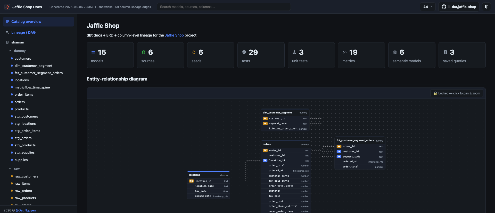
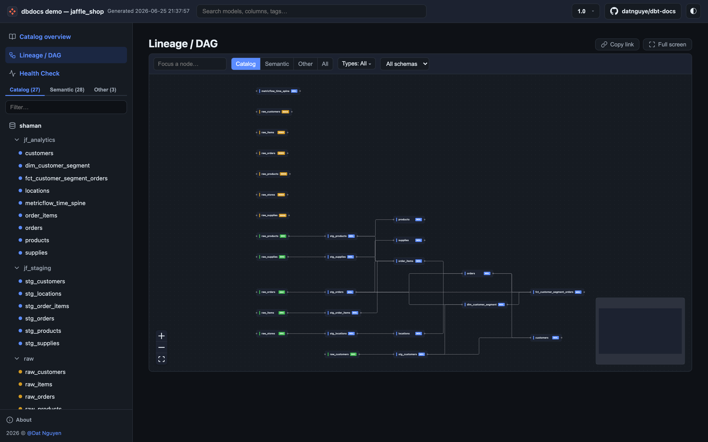
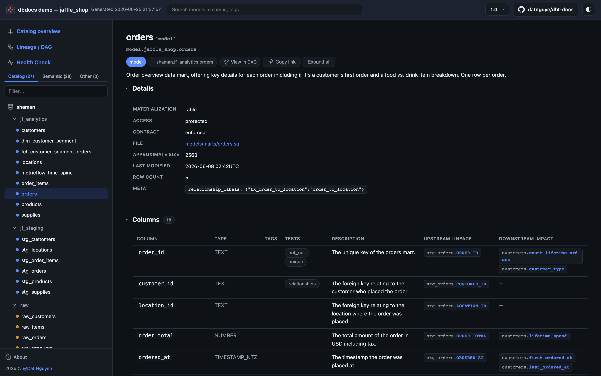

# dbdocs

<p align="center">
  
</p>

<p align="center"><b>An alternative dbt docs site — catalog + ERD + column-level lineage.</b></p>

Turn your dbt artifacts into a single self-contained `index.html`: a browsable catalog, an interactive lineage DAG and ERD, and **column-level lineage** derived straight from your compiled SQL. No server, no database, no build step — just a file you can open or host anywhere.

[:rocket: Try the live demo](/latest/demo/latest/){ .md-button .md-button--primary target="_blank" }
[Quickstart](./nav/guide/quickstart.md){ .md-button }

The demo is a real dbdocs site built from the
[jaffle_shop](https://github.com/dbt-labs/jaffle_shop) dbt project — poke around
the catalog, the lineage DAG, the ERD, and column-level lineage.

<a href="/latest/demo/latest/" target="_blank">
  
</a>
<p align="center"><em>The catalog overview — project counts and the entity-relationship diagram, grouped by database and schema.</em></p>

<a href="/latest/demo/latest/#/dag" target="_blank">
  
</a>
<p align="center"><em>The interactive lineage DAG — pan, zoom, filter, and deep-link to any node.</em></p>

<a href="/latest/demo/latest/#/node/model.jaffle_shop.orders" target="_blank">
  
</a>
<p align="center"><em>Per-model detail — every column with its type, description, and <strong>upstream column-level lineage</strong> traced from compiled SQL.</em></p>

---

## What you get

dbt's own docs are great until you want lineage at the *column* level — that's the gap dbdocs fills.

- **Catalog navigation** grouped by database and schema, with client-side search (no backend).
- **Per-model detail** — columns (type / tags / description), compiled and raw SQL, and the macros each model resolves.
- **Interactive graphs** — a node-level lineage DAG and an ERD, both built on [React Flow](https://reactflow.dev/): pan / zoom / minimap, automatic [dagre](https://github.com/dagrejs/dagre) layout, filter-and-focus, and deep-links to any node.
- **Column-level lineage** traced from each model's compiled SQL via [sqlglot](https://github.com/tobymao/sqlglot).
- **Dark / light** theme.
- **Versioned deploy** with a built-in version dropdown — no mike, no plugins.

---

## Installation

!!! warning "Requires Python 3.10+"
    dbdocs leans on the dbt artifact parser and sqlglot, both of which long ago moved past Python 3.9 — so we did too. Upgrading your interpreter is the way forward (it's worth it).

<div class="termynal" data-termynal data-ty-typeDelay="40" data-ty-lineDelay="700">
    <span data-ty="input">pip install dbdocs --upgrade</span>
    <span data-ty="progress"></span>
    <span data-ty>Successfully installed dbdocs</span>
    <a href="#" data-terminal-control="">restart ↻</a>
</div>

Verify installation:

```bash
dbdocs --version
```

---

## Quickstart

First, produce dbt artifacts in your dbt project (the bit dbdocs reads):

```bash
dbt docs generate           # writes target/manifest.json + target/catalog.json
```

Then generate, serve, and open the site:

```bash
dbdocs generate             # builds ./site/index.html with all data baked in
dbdocs serve                # static http server on http://127.0.0.1:8000
```

Head to the [Quickstart guide](./nav/guide/quickstart.md) for the full walkthrough.

---

## Contributing

Contributions are welcome — bugs, features, docs, typos. See the
**[Contributing Guide](./nav/development/contributing-guide.md)**.

If dbdocs saves you some clicks, consider
[buying me a coffee](https://www.buymeacoffee.com/datnguye).

[](https://www.buymeacoffee.com/datnguye)

---

<div align="center">

**Made with ❤️ by Dat Nguyen**

</div>
